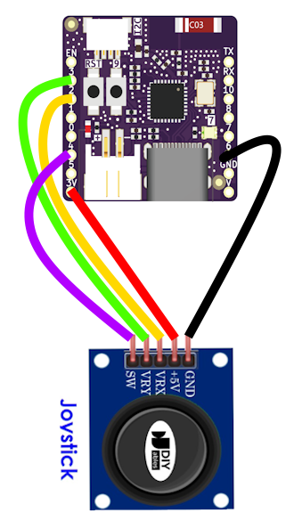

# PicoWing

**PicoWing** est un projet open-source d’**avion en papier radiocommandé (RC)**, combinant électronique embarquée, plaisir de voler.  
Ce projet est divisé en 2 parties :
- PicoWingPilot : la télécommande
- PicoWingPlane : la motorisation de l'avion en papier

---

ATTENTION ! Je viens de commencer le projet. Donc rien n'est fonctionnel pour le moment. Je viendrais mettre à jour au fur et à mesure de mes avancées. 

---

## Présentation

L’objectif du projet est de transformer un simple avion en papier en appareil RC complet, grâce à des cartes électroniques ultra-compactes intégrant :

- Un système de commande radio (RC) ESPNOW
- Deux MOSFET de puissance pour la gestion de 2 moteurs
- alimentation et recharge de la batterie lipo
- Une conception permettant aux makers de tous niveaux d'en fabriquer !

---

## PicoWingPilot

C'est la télecommande du projet. Elle permet le passage d'ordres à l'avion via le protocole ESPNOW.
L'ESP32 C3 Pico a été choisit car il intègre la gestion de l'alimentation et la recharge.
Il est en outre très compact.
L'idée est de réaliser une manette proche d'une nunchuk mais il ne possèdera qu'un seul joystick et pas d'autres boutons.
Pourquoi ? tout simplement pour qu'il y est le moins de soudures possibles et que cela soit donc réalisable par le plus grand nombre !
Il pourra gérer :
- l'appairage avec l'avion
- le réglage du trim du roulis (droite/gauche)
- le choix de la diffculté de pilotage
- l'affichage d'alertes pour le niveau de batterie de l'avion (via la led RGB de la carte ESP32 C3 Pico)
- la mise en veille de la manette si non utilisée pendant plus de 60s. Un clic sur le joystick le réveillera.

### Matériel côté télécommande
- une carte ESP32 C3 PICO
- un module joystick KY-023
- une lipo 1s

### Schéma de montage

**Connexions :**
- 🟢 **GPIO 2** → VRX (Axe X du joystick)
- 🟡 **GPIO 3** → VRY (Axe Y du joystick) 
- 🟣 **GPIO 4** → SW (Bouton joystick)
- 🔴 **5V** → VCC (Alimentation KY-023)
- ⚫ **GND** → GND (Masse commune)
- 
### Firmware pour l'ESP C3 Pico

!!!! EN COURS DE DEV - ECRITURE DU SOURCE OK MAIS IL FAUT TESTER!!!! 

Le source est dans le dossier `/PicowingPilot/Src`

Depuis l'application arduino IDE, il faudra compiler le binaire après avoir téléchargé les fichiers.
Il faut avoir installer la bibliothèque *Adafruit_NeoPixel* pour que la compilation fonctionne.
Il faut égalment selection la carte *LOLIN C3 Pico*
- Ouvrir Arduino IDE → Fichier → Préférences.
- Dans URL de gestionnaire de cartes supplémentaires, s'assurer d’avoir :
`https://raw.githubusercontent.com/espressif/arduino-esp32/gh-pages/package_esp32_index.json`
- Ensuite : Outils → Type de carte → Gestionnaire de cartes → chercher esp32 → installer la dernière version.
- Après installation, va dans Outils → Type de carte → ESP32 Arduino → LOLIN C3 Pico.
- Vérifie aussi : Fréquence CPU, Flash Size, etc. par défaut ça passe.

Il doit être possible de compiler via PlateformIO mais je ne l'utilise pas donc je ne connais pas les paramètres à y appliquer.

Je proposerai plus tard au téléchargement le fichier *.bin* près à être uploadé dans le c3 pico.

---

## PicoWingPlane - PARTIE A  VENIR

### Matériel côté avion - PARTIE A  VENIR
- ESP32 C3 PICO
- carte DIY pemettant de gerer l'étage de puissance vers les moteurs
- lipo 1s
- 2 moteurs coreless avec les hélices

---

## Licence

Ce projet est distribué sous licence **MIT** pour le code et **CERN-OHL-S** pour le hardware.

---

## Contributions

Les contributions sont les bienvenues !  
Forkez, ouvrez des issues ou proposez vos améliorations via pull request.

---

**PicoWing — Voler léger, voler libre.**
